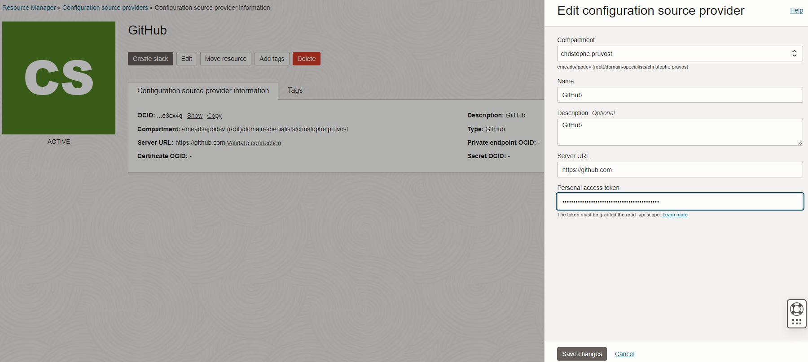
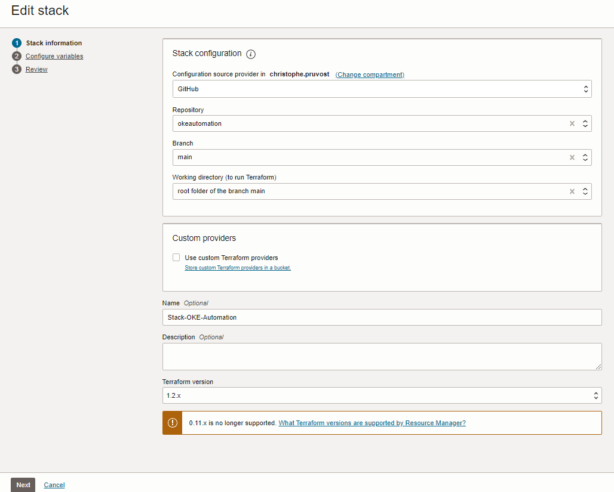
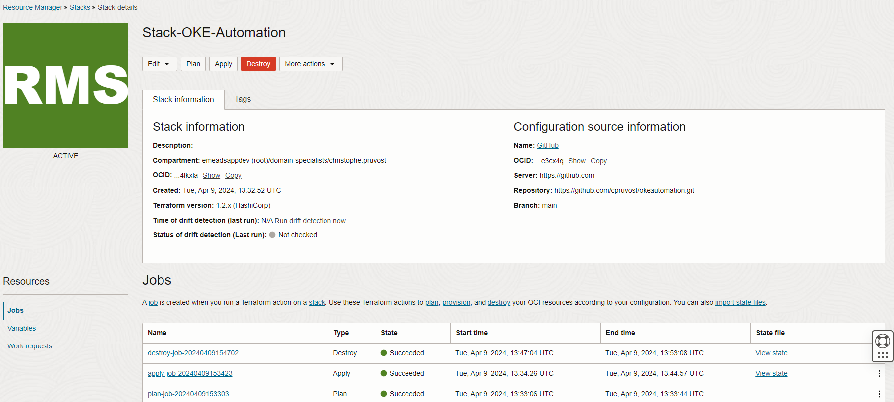

# Terraform Automation on Oracle Cloud with OCI Stack Resource Manager: Create an OKE with Managed nodes in a VCN where you can choose IP cidr Blocks

This project has been designed to run with OCI Stack Resource Manager.

Note 1 : If you want to run it with Terraform alone on your laptop for ex then you need to modify some files. Look at comments in variables.tf, main.tf, and provider.tf. And you need to initialize some variables. Rename env-vars-template.ps1 to env-vars.ps1 and update all the parameters with your values (or sh if linux) and then run env-vars.ps1 on your laptop befor eusing terraform.

Note 2 : that there are 2 modules (one for the network and one for the OKE). This stack was created from a reverse engineering of the OKE Wizard. It is more simple to begin from an example :o). Reading the network files you can understand the requisites for the network part (there are 3 subnets in the VCN and you can have a look to the security rules needed by OKE). 

Note 3 : the OKE API and the Loab Balancer subnets are public because for a test purpose it is more simple (no need to use the OCI Bastion Service). Sure the pods subnet is private !.

## Prerequisites

You must know Terraform a little. Remember (plan is for checking that the stack is nice and that you have no error, apply is for creating the stack, and destroy is for deleting the stack )

## Step 1 : Clone the github repo --> https://github.com/cpruvost/okeautomation
You will use then your own github repo on your own github account.

## Step 2 : On OCI Resource Manager create a configuration source provider named GitHub for ex
Do not forget to create first your github token on github.com because you will need it.

.

## Step 3 : Create the OCI Stack
You have only 3 parameters to enter, it cannot more simple. Note that the ssh key is the public ssh key of the Virtual Machine that will be created by the OKE Node Pool. It will allow you to connect to these VMs with ssh if you want but as the VM are in a private subnet you will need to use the OCI Bastion Service. Nevertheless you probably never need to connect to the VMs with SSH.

You will use your github repo in this stack so.
.

[You can have a list of the OCI regions on this link](https://docs.oracle.com/en-us/iaas/Content/General/Concepts/regions.htm)

Do not forget to set all the input variables :
- compartment_ocid
- region
- node_shape
- ssh_public_key
- worker_node_number
- type_shape
  
 Note only 2 options were tested in Paris Region :
 - option 1 : node_shape = "VM.Standard.Ampere.Generic" + type_shape = "arm"
 - option 2 : node_shape = "VM.Standard.E4.Flex" + type_shape = "amd"

If you want to test more options you need to update the map InstanceImageOCID knowing that you must search for the good OKE image ocid. You can list the OKE image ocid using oci cli. Ex oci ce node-pool-options --profile EMEAPARIS get --node-pool-option-id all --> You will get all OKE image ocid from Paris Region. 

## Step 4 : Do a plan / apply / destroy on the stack as you want.

.
